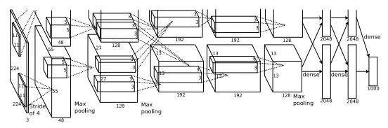
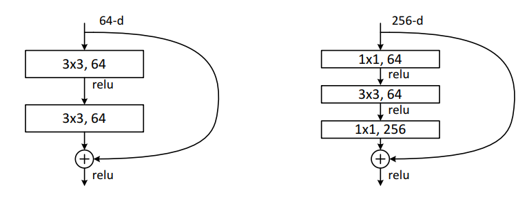
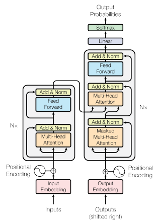

# survey-computer-vision

## textlint

```shell
$ yarn install
$ npx textlint README.md
```

## AlexNet

### 論文概要

#### どんなもの？
[ImageNet Classification with Deep Convolutional Neural Networks](https://proceedings.neurips.cc/paper/2012/file/c399862d3b9d6b76c8436e924a68c45b-Paper.pdf)

2012年のILSVRCというImageNetを用いた画像分類コンペで圧勝したモデル。

#### 先行研究と比べてどこがすごい？
2012年までは人間が画像から特徴量を設計し、それを用いて分類を行っていたが、AlexNetが2012年のILSVRCで圧勝したことにより機械によって特徴量を抽出できることが示された。また当時、畳み込み演算を含む大規模なCNNを学習することはコストの面で難しかったが、GPUに最適化された畳み込み演算の実装を行うことで学習時間を短縮した。

#### 技術や手法のキモはどこ？
- ReLU
  - 
  - シグモイド関数やtanh関数などの非線形関数よりも数倍速く学習できる
  - 勾配消失対策
- GPUによる並列計算
  - ネットワークの中の一部のみでGPU間の通信を行うことで、計算を効率化した。
- ReLUと輝度の正規化の組み合わせが良かった。
- Overlapping Pooling
  - プーリング層でダウンサンプルする領域を少しずつ被せることで過学習しにくくなった
- Dropoutで過学習を防いだ。
- 水平移動や反転などのData Argumentationによって教師データを増やした。

#### どうやって有効だと検証した？
ImageNetの2011年秋の版で事前学習したAlexNetを2012年のILSVRCでfine tuningすると、テストデータにおいてエラー率は15.3%となった。

#### 議論はある？
中間層をひとつでも取り除くとネットワークの性能が低下するので、ネットワークの深さは非常に重要である。教師データを増やさずにネットワークを大きくしたり、教師なしの事前学習でさらなる性能が得られるかもしれない。

#### 次に読むべき論文は？

### アーキテクチャ詳細


<p style="text-align: center;">画像は<a href="https://proceedings.neurips.cc/paper/2012/file/c399862d3b9d6b76c8436e924a68c45b-Paper.pdf" target="blank_">論文</a>より引用</p>

5層の畳み込み層と3層の全結合層からなる。

### 実装の参考
- [vision/alexnet.py at main · pytorch/vision](https://github.com/pytorch/vision/blob/main/torchvision/models/alexnet.py)

## ResNet

### 論文概要

#### どんなもの？
[Deep Residual Learning for Image Recognition](https://arxiv.org/abs/1512.03385)

Microsoft Researchが2015年に提案したモデル。

#### 先行研究と比べてどこがすごい？

当時、画像認識において一般にCNNの層数を増やすことでより高次元の特徴を獲得することは知られていたが、単純に層を重ねるだけでは性能が悪化していく勾配消失問題があった。ResNetでは`shortcut connection`という機構を導入し、手前の層の入力を後ろの層に直接足し合わせることで、この勾配消失問題を解決した。

#### 技術や手法のキモはどこ？



<p style="text-align: center;">画像は<a href="https://arxiv.org/pdf/1512.03385.pdf" target="blank_">論文</a>より引用</p>

図の左側が`building block`と呼ばれ、右側が`bottleneck building block`と呼ばれる。この構造によって勾配がより手前の層まで伝わるようになった。

#### どうやって有効だと検証した？
ILSVRCという毎年開催されていたImageNetを用いた画像分類コンペにおいて、2014年以前はせいぜい20層程度(VGGが16か19層、GoogleNetが22層)のモデルで競っていた。しかしResNetは152もの層を重ねて学習させることに成功し、2015年のILSVCRで優勝した。

#### 議論はある？

#### 次に読むべき論文は？

### アーキテクチャ詳細

### 実装の参考

- [vision/resnet.py at main · pytorch/vision](https://github.com/pytorch/vision/blob/main/torchvision/models/resnet.py)

## Transformer

### 論文概要

#### どんなもの？
[Attention is All You Need](https://arxiv.org/abs/1706.03762)

2017年に提案された自然言語処理のモデル。コンピュータビジョンのモデルではないものの、この論文で提案されたEncoder-DecoderモデルのTransformerというアーキテクチャが後発のコンピュータビジョンのモデルに大きな影響を与えたので、ここで取り上げる。

#### 先行研究と比べてどこがすごい？
当時、Seq2SeqのモデルではRNNやCNNと併用してAttentionを用いるものがあったが、この論文ではRNNやCNNを排除してAttentionのみのTransformerというアーキテクチャを提案した。Transformerによって並列化が可能になって学習にかかる時間が削減され、精度も向上し、入力と出力の文章離れた位置にある任意の依存関係を学習しやすくなった。

#### 技術や手法のキモはどこ？

Attentionは、各単語に対してQuery()とKey()、及びのValue()を持たせ、それらを用いて計算する。  
- Self Attention
  - レイヤーごとの計算量が少ない
  - 並列化しやすい
  - 離れたところでも依存関係を学習できる
  - 解釈性がある
- Scaled Dot Product Attention
  - 各Queryと各Keyの内積にsoftmax関数を適用し、QueryとKeyの関連度を計算する。さらにこれをValueとの内積をとることで、各Queryと類似度の高いKeyに対応するValueほど重く重みづけされたValueの重み付き和が得られる。ここで、QueryとKeyは  次元、Valueは次元である。
  

  - QueryとKeyの内積をで割っているのは、が大きくなったときにQueryとKeyの内積が大きくなり、softmaxの勾配が極端に小さくなっていまうのを防ぐためである。
- Multi Head Attention
  - 各単語に対して1組の次元のQuery、Key、Valueを持たせるのではなくて、それらを種類の異なる重みベクトルで写像したもので種類の異なるAttentionを計算することで、それぞれで異なる部分空間から有益な情報を抽出する。
    
  ただし
- Positional Encoding
  - 再帰や畳み込みを排除しているので、単語の順序把握するためにPositional Encodingを利用する。
  - ここではサインとコサインを利用している。

#### どうやって有効だと検証した？
WMT 2014 English-German、 WMT 2014 English-Frenchというデータセットで英語からドイツ語、フランス語への翻訳タスクを行った。結果は英語-ドイツ語翻訳タスクではBLEUスコア28.4、英語-フランス語翻訳タスクではBLEUスコア41.8でstate-of-the-artを達成した。

#### 議論はある？
Attentionベースのモデルに期待しており、これをテキスト以外に画像、動画、音声などで活用できるようなAttentionを研究する予定だ。

#### 次に読むべき論文は？


### アーキテクチャ詳細


<p style="text-align: center;">画像は<a href="https://arxiv.org/pdf/1706.03762.pdf" target="blank_">論文</a>より引用</p>

- DecoderのMasked Multi Head Attentionは、対象単語より左の単語のみに依存するように、softmaxの入力値を一部マスクしている。
- Multi Head AttentionやFeed ForwardにはResidual構造がある。
### 実装の参考
- [pytorch/transformer.py at main · pytorch/pytorch](https://github.com/pytorch/pytorch/blob/master/torch/nn/modules/transformer.py)
